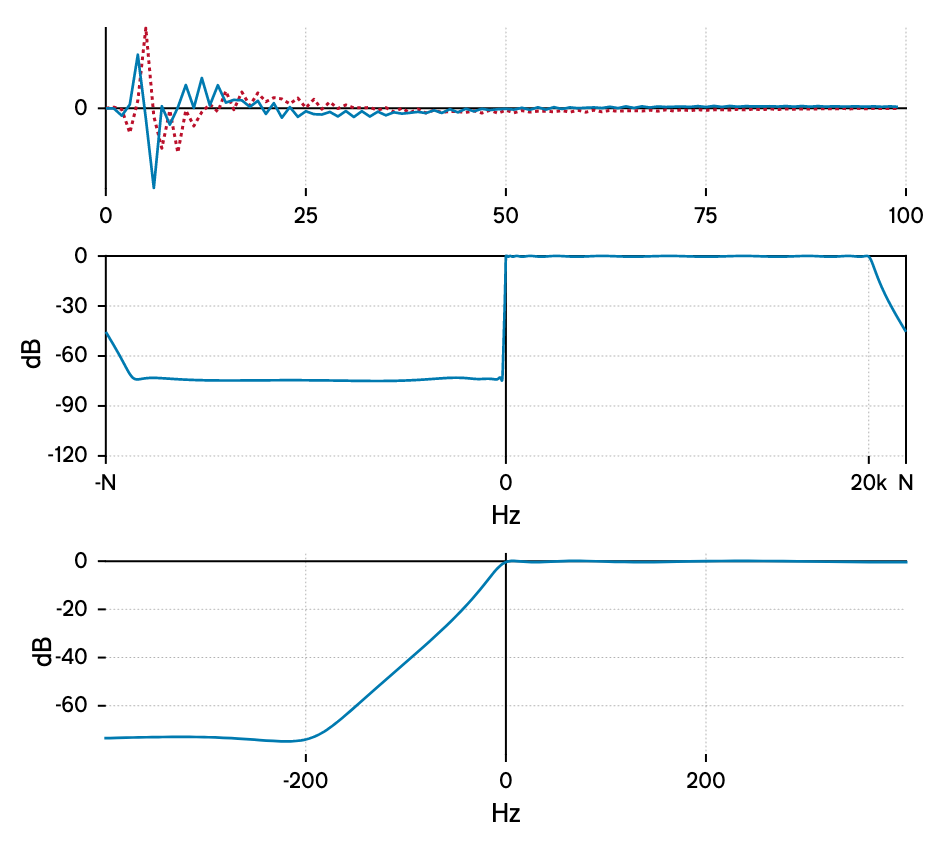
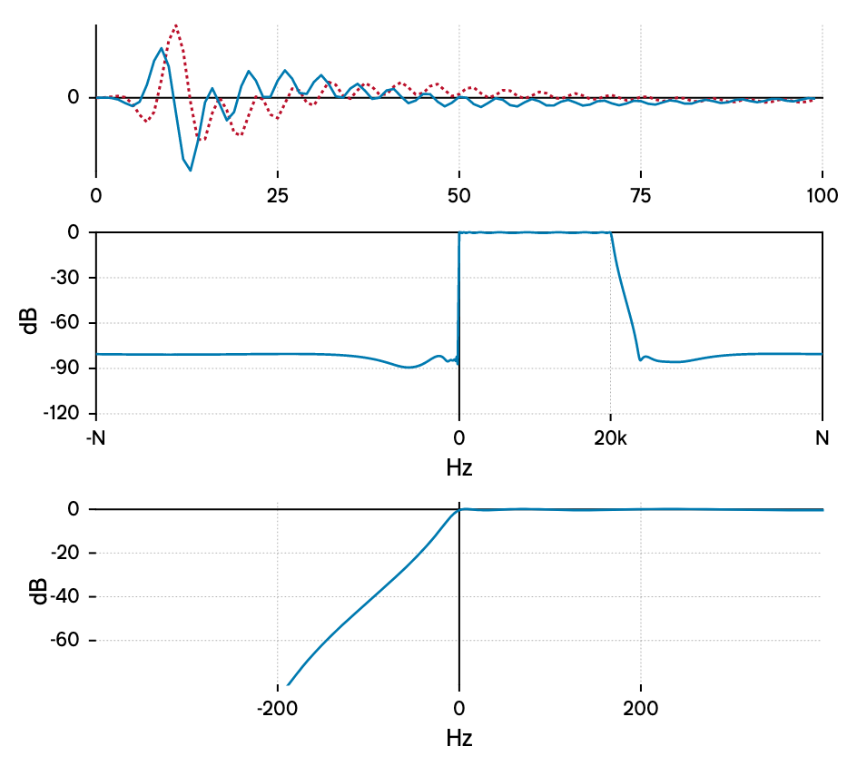

# Signalsmith's IIR Hilbert

This is a (short, dependency-free, single-file C++ header) IIR Hilbert filter with an [0BSD License](LICENSE.txt).

It uses a pre-baked continuous-time filter, which is converted into a discrete-time filter (with an upper cutoff of 20kHz) for a given sample-rate.  This gives it the same phase/amplitude responses at higher sample-rates (as per my API London 2024 talk).

## How to use it:

```cpp
#include "hilbert.h"
using HilbertIIR = signalsmith::hilbert::HilbertIIR<float>;
```

Single-channel:

```cpp
HilbertIIR hilbert(48000); // 48kHz

float in = /*...*/;
std::complex<float> out = hilbert(in);
```

Multi-channel:

```cpp
HilbertIIR hilbert(44100, 2); // 44.1kHz stereo

float in0 = /*...*/, in1 = /*...*/;
std::complex<float> out0 = hilbert(in0, 0);
std::complex<float> out1 = hilbert(in1, 1);
```

Reset the state to 0:

```cpp
hilbert.reset();
```

The constructor has an optional third `passbandGain` argument.  This defaults to `2` to compensate for the negative frequencies being removed, and means the volume will match if you just use `complex.real()`. 

## Response

Here's the impulse/spectrum when running at 44.1kHz:



Here's the impulse/spectrum when running at 96kHz:



The passband ripple is 0.5dB.

### Filter design / IIT

A continuous-time filter is designed in Python / SciPy (`design/design.py`).  It's [rephrased as](https://docs.scipy.org/doc/scipy/reference/generated/scipy.signal.residue.html) the sum of parallel complex 1-pole filters, and printed as C++ code.

The C++ code (`hilbert.h`) then converts this to a discrete-time filter using the [Impulse Invariant Transform](https://en.wikipedia.org/wiki/Impulse_invariance#Effect_on_poles_in_system_function), so we now have the sum of parallel *discrete-time* complex 1-pole filters.  This is what we use to compute the result.

### Plots

The code in `design/main.cpp` generates SVG plots of the impulse/spectrum, so if you change the filter design you can see the results.

## License / modifications

The license is [0BSD](LICENSE.txt), which lets you use/modify/redistribute the code for any purpose ("public domain equivalent").  If you need anything else, get in touch.

If you redesign the filter coefficients, please add that clearly to any docs/description so that users know what to expect.

If you translate this code into any other programming language (which would be awesome!), send us a message/email so we can add a link here.
